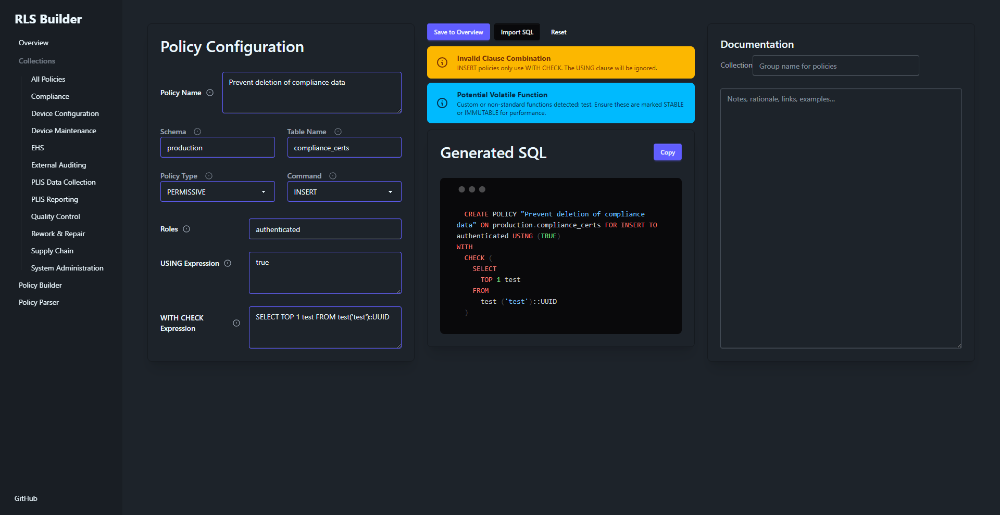
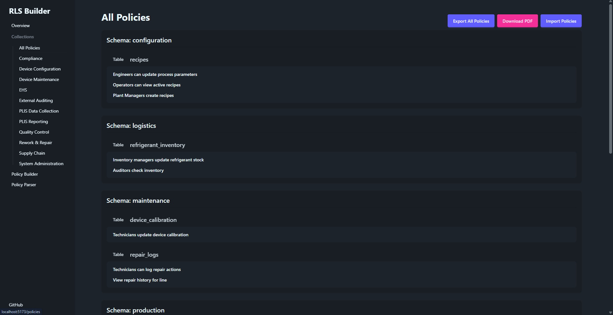

# PostgreSQL Row Level Security (RLS) Builder & Auditor

Patrik Valentiny

---

## Introduction & Problem Statement

### The Shift of Modern SaaS

- Authorization logic moving to Database (Supabase, PostgREST).

### The Role of Row Level Security (RLS)

- Enforces security at the database level.
- Prevents leaks even if application layer is bypassed.

### The Pain Points

- **Security Risks:** "Blind Writes" (Missing `WITH CHECK` clauses).
- **Complexity:** Managing raw SQL policies without visualization is a challenge.

---

## Project Solution: The RLS Toolkit

*A locally-run React Single Page Application (SPA)*

### 1. Policy Builder (Security by Design)

- Abstracts SQL syntax via UI to ensure correctness.
- Generates real-time `CREATE POLICY` statements.

### 2. Policy Linter (Vulnerability Management)

- Custom recursive descent parser.
- Audits for "Security Smells" (e.g., `USING (true)` on updates).

### 3. Management & Auditing

- Dashboard visualization and PDF reporting.

---



---



---

## Technical Architecture & Security

### Local-First Design

- Runs entirely in-browser using IndexedDB (via `localforage`).

### Privacy & Security

- Sensitive schema info and policy logic **does not leave the user's machine** unless explicitly exported.

### The Stack

- React 19, TypeScript, wouter, @react-pdf/renderer
  
```bash
$ pnpm audit
No known vulnerabilities found
```

---

## Software Security Standards Alignment

### OWASP Top 10 (2025)

- **A01 Broken Access Control:** Enforcing rules at the database level.
- **A02 Security Misconfiguration:** Linter catches permissive rules.

### Cyber Resilience Act (CRA)

- **Phase 1 (Design):** Builder ensures syntax correctness.
- **Phase 2 (Vulnerability Management):** Linter scans for risks.
- **Phase 3 (Transparency):** PDF Reports for documentation.

---

## Conclusion & Demo Highlights

### Summary

- This project shrinks the gap between **raw SQL** and **secure database policies**.
- Empowers developers to implement RLS policies confidently.
- Create auditable documentation for compliance.
