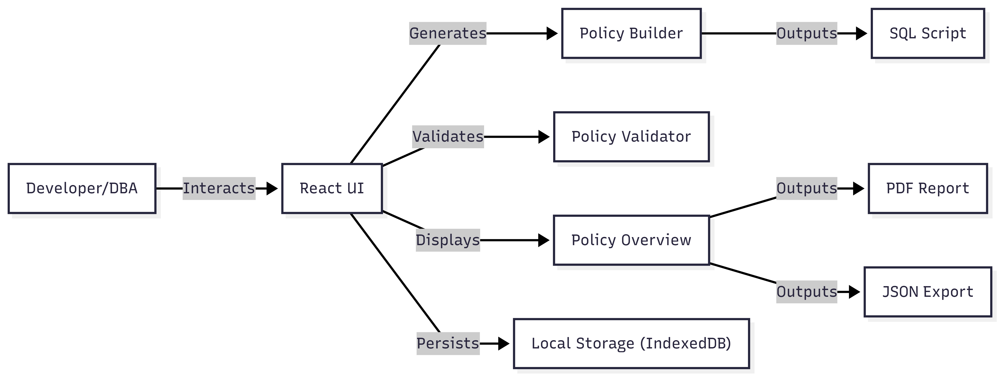
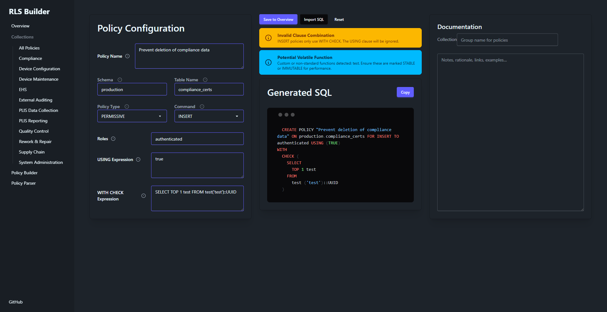
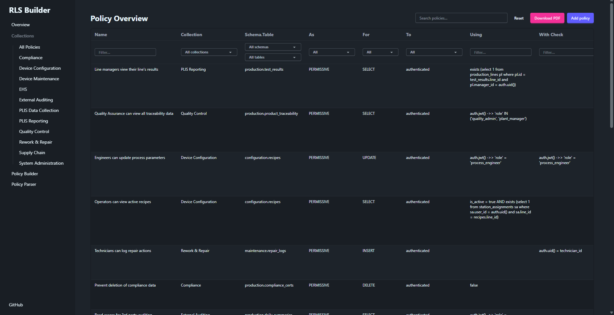
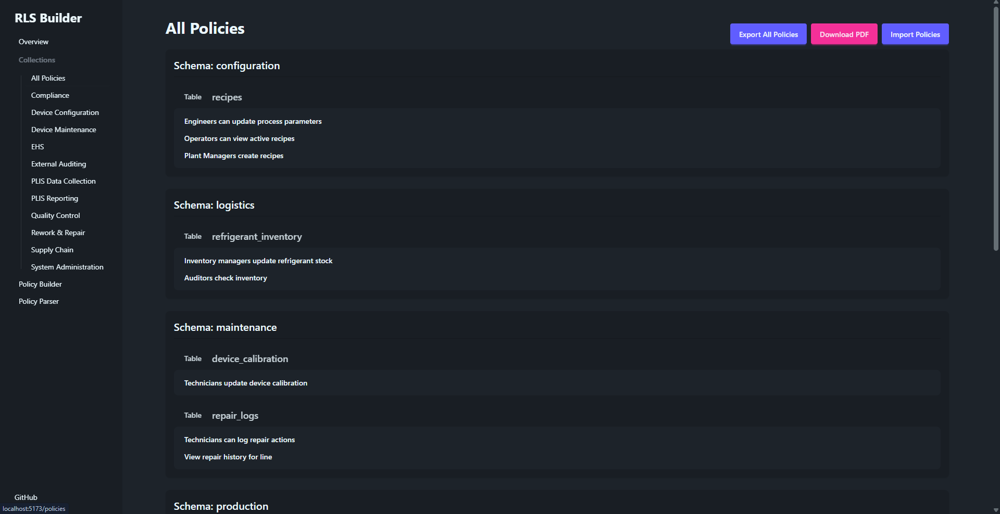
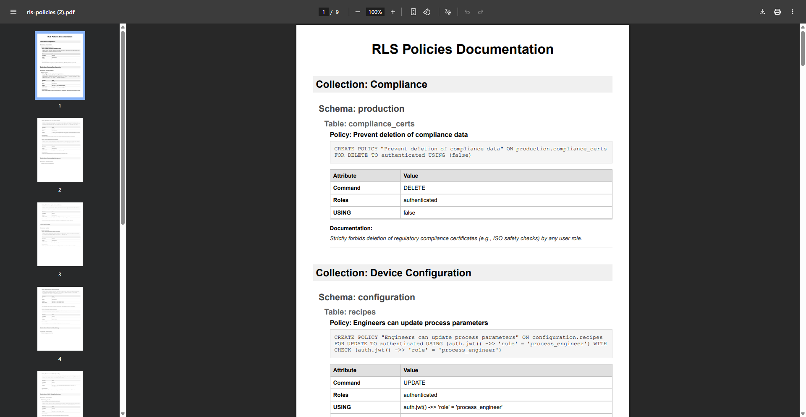

<div style="text-align: center; padding-top: 300px;">

# PostgreSQL Row Level Security (RLS) Builder & Auditor

**Student:** Patrik Valentiny  
**GitHub Repository:** [https://github.com/patrikvalentiny/rls-builder](https://github.com/patrikvalentiny/rls-builder)

</div>

<div style="page-break-after: always;"></div>

## 1. Problem Statement

In modern SaaS architectures, particularly those leveraging PostgreSQL as database with tools like Supabase or PostgREST, the database often acts as the direct backend for frontend applications. This shift places the burden of **authorization** entirely on **PostgreSQL Row-Level Security (RLS)**.

### 1.1. What is Row-Level Security (RLS)?

PostgreSQL Row-Level Security (RLS) is used to enforce authorization rules directly within the database engine, RLS ensures consistent security logic regardless of whether data is accessed via a backend API, direct SQL query, or third-party tool, effectively preventing data leaks even if the application layer is bypassed.

#### Reference Implementation

Consider a `todos` table where users should only see their own tasks.

```sql
--**1. Policy Definition:**
CREATE POLICY "user_isolation" ON todos
FOR SELECT
USING (auth.uid() = user_id);
--**2. Application Query:**
---When the app (or a user) runs a simple query:
SELECT * FROM todos;
--**3. Effective Execution:**
--Behind the scenes, Postgres tacks on the policy condition automatically. It effectively runs this:
SELECT * FROM todos
WHERE auth.uid() = user_id; -- Injected by RLS
```

### 1.2. Challenges with RLS Implementation

While RLS is a powerful tool for securing data, relying on it as an authorization layer introduces significant challenges:

1. **Security & Integrity Risks:** Writing raw SQL for policies can be error-prone. A frequent vulnerability is the "Blind Write," caused by omitting the `WITH CHECK` clause in `INSERT` and `UPDATE` policies. This oversight allows users to create or modify data that they cannot subsequently see, potentially violating tenant isolation.
2. **Management Complexity:** As schemas grow, the number of policies increases, creating a complex set of rules. Standard database tools lack dedicated features to visualize, audit, or validate these policies effectively, making it difficult for developers to maintain a clear mental model of the security architecture.
3. **Lack of Standardization:** Without a structured approach, policy definitions can be hard to standardize across developers and teams, leading to inconsistencies and potential security gaps.

This project addresses these challenges by providing a toolkit for designing, validating, and managing RLS policies.

## 2. Project Description

The goal of this project is to provide a comprehensive toolkit that assists developers in the **Design**, **Validation**, and **Management** of RLS policies. The solution is a web-based application that runs locally in the browser.

The project was divided into three core components:

### 2.1. RLS Policy Builder (Security by Design)

This component provides a UI that abstracts the RLS SQL syntax, ensuring policies are syntactically correct.

- **Functionality:** Users configure policies via a form (selecting Tables, Roles, Commands). The builder automatically generates the correct SQL policy statement.
- **Organization:** Users can group multiple policies into Collections for better organization.
- **Documentation:** Contextual documentation can be added to each policy, which is included in generated PDF reports for auditing.

### 2.2. RLS Policy Linter (Vulnerability Management)

A static analysis engine designed to audit existing policies and detect potential vulnerabilities during the development phase.

- **Parsing:** The tool accepts raw SQL policy definitions and parses them into structured objects.
- **Linting:** It runs certain validators against the parsed policies to detect:
  - **Security Smells:** e.g., `USING (true)` on `UPDATE`/`DELETE` operations (broad access risk).
  - **Performance Issues:** e.g., Implicit type casting in functions which can disable index usage.
  - **Logic Errors:** Recursion risks in policy definitions.
  - **Integrity Flaws:** e.g., Missing `WITH CHECK` expressions on `INSERT` or `UPDATE` commands.

### 2.3. Policy Overview & Management (Visualization)

Visualization tools to help developers maintain a clear mental model of their security architecture.

- **Dashboard:** A table listing all policies, filterable by attributes (Table, Role, Command Type, etc.), allowing for quick inspection.
- **Aggregated View:** Groups policies by **Collections**, serving as a high-level overview of the RLS strategy for a given application.

### 2.4. Cyber Resilience Act (CRA)

This helps developers prepare for the upcoming EU Cyber Resilience Act (CRA) by addressing  requirements for secure software development:

- **Security by Design (Phase 1):** The Policy Builder ensures that security configurations are syntactically correct from the start, preventing common errors before they occur.
- **Vulnerability Management (Phase 2):** The Policy Linter acts as an automated vulnerability scanner, identifying certain common risks.
- **Transparency & Documentation (Phase 3):** The Policy Overview and PDF reporting tools generate clear, audit-ready documentation, satisfying requirements for transparency and record-keeping.

### 2.5. OWASP Top 10 Alignment

This project helps manage critical security risks identified in the **OWASP Top 10 (2025)**:

- **A01:2025-Broken Access Control:** By enforcing authorization at the database level and providing tools to validate these rules, preventing unauthorized access to data.
- **A02:2025-Security Misconfiguration:** The Policy Linter helps detect insecure configurations (like missing `WITH CHECK` clauses or overly permissive policies) that often lead to vulnerabilities.

## 3. System Architecture & Work Completed

### 3.1. System Architecture

The RLS Builder is designed as a **Single Page Application (SPA)** that runs entirely locally in the browser, ensuring that sensitive policy definitions and potential database schema information never leave the user's local machine unless explicitly exported.

- **Core Framework:** Built with **React 19** and **TypeScript** using **Vite** for a fast development and build process.
- **UI Component Library:** Utilizes **Tailwind CSS** for styling and **DaisyUI** for pre-built, accessible UI components (drawers, forms, modals).
- **Routing:** Implements **wouter** for lightweight, client-side routing between the Builder, Parser, Overview and Collections modules.
- **Persistence Layer:** Uses **localforage** to abstract client-side storage (IndexedDB), allowing for persistent storage of policy collections across sessions without a backend database.
- **PDF Generation:** Integrates **@react-pdf/renderer** to generate client-side PDF reports for auditing and documentation purposes.

### 3.2. Work Completed

The project has successfully implemented the three core modules defined in the project description:

#### 1. Policy Builder Module

- **Form-Based Interface:** A policy builder form allows users to define policies by selecting schemas, tables, commands, and roles.
- **Real-time SQL Generation:** As users modify the form, the application generates the corresponding PostgreSQL `CREATE POLICY` SQL statement in real-time.

#### 2. Policy Parser & Linter Module

- **SQL Parsing Engine:** A custom recursive descent parser implemented in TypeScript that deconstructs raw `CREATE POLICY` SQL statements into structured objects. This approach allows for precise handling of SQL syntax and structure without the overhead of heavy external AST (Abstract syntax tree) libraries.
- **Validation Engine:** A modular validation system that currently includes:
  - **Security Checks:** Detects high-risk patterns like `USING (true)` on `UPDATE`/`DELETE` operations which could lead to accidental data loss or exposure.
  - **Performance Checks:** Identifies performance bottlenecks such as scalar subqueries (recommending `EXISTS` instead) and usage of volatile functions that might prevent index usage.
  - **Syntax Analysis:** Warns about potential implicit type casting issues in policy expressions.
  - **Integrity Flaws:** Shows an error when `WITH CHECK` expressions are missing on `INSERT` or `UPDATE` commands.

#### 3. Policy Management & Overview

- **Dashboard:** A central hub that displays all stored policies, organized by collection.
- **CRUD Operations:** Full capability to Create, Read, Update, and Delete policies within the local store.
- **Export Capabilities:** Allows users to export a JSON file containing the policies for backup or sharing.
- **Auditing:** Implementation of PDF generation to create professional audit reports containing policy definitions and documentation.

## 4. Design & Relevant Models

### 4.1. Policy Data Model

The internal representation of a policy ensures all necessary components are captured before SQL generation.

```typescript
interface CreatePolicy {
    name: string;
    schema: string;
    table: string;
    as: typeof POLICY_TYPES[number];
    for: typeof COMMAND_TYPES[number];
    to: string;
    using: string;
    withCheck: string;
}
```

The `StoredPolicy` interface extends `CreatePolicy` by adding metadata for persistence and documentation.

```typescript
interface StoredPolicy extends CreatePolicy {
    id: string;
    collection: string;
    documentation: string;
    createdAt: number;
    updatedAt: number;
}
```

<div style="page-break-after: always;"></div>

### 4.2. Application Architecture

The application runs entirely client-side to ensure security (no database credentials are shared).


**Chart 1:** High-level architecture of the application.

### 4.3. Interface Previews


**Figure 1:** The Policy Builder form showing linter output.


**Figure 2:** The Policy Overview dashboard.


**Figure 3:** The Collection View.


**Figure 4:** Sample PDF report generated for auditing.

## 5. References

1. **PostgreSQL Documentation: CREATE POLICY**  
   [https://www.postgresql.org/docs/current/sql-createpolicy.html](https://www.postgresql.org/docs/current/sql-createpolicy.html)
2. **Bytebase: Postgres Row Level Security Footguns**  
   [https://www.bytebase.com/blog/postgres-row-level-security-footguns/](https://www.bytebase.com/blog/postgres-row-level-security-footguns/)
3. **Supabase: Row Level Security**  
   [https://supabase.com/docs/guides/database/postgres/row-level-security](https://supabase.com/docs/guides/database/postgres/row-level-security)
4. **PostgreSQL Documentation: Row Security Policies**  
   [https://www.postgresql.org/docs/current/ddl-rowsecurity.html](https://www.postgresql.org/docs/current/ddl-rowsecurity.html)
5. **OWASP Top 10: A01:2025-Broken Access Control**  
   [https://owasp.org/Top10/2025/A01_2025-Broken_Access_Control/](https://owasp.org/Top10/2025/A01_2025-Broken_Access_Control/)
6. **OWASP Top 10: A02:2025-Security Misconfiguration**  
   [https://owasp.org/Top10/2025/A02_2025-Security_Misconfiguration/](https://owasp.org/Top10/2025/A02_2025-Security_Misconfiguration/)
